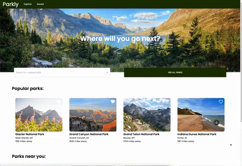
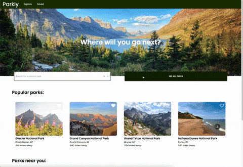
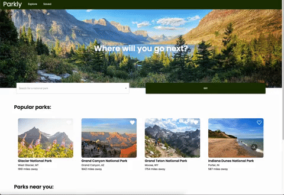

# Parkly
Parkly is a multipage web application designed to help users discover and explore national parks in the United States.

## Tech Stack

## Demo
[Full Demo Video](https://drive.google.com/file/d/1o4Zq98R9b2dtdowJidgzdpqSwTu2lt4q/view?usp=share_link)

## Page Details & Demos
### Home Page
The home page gives users the option to search for a specific national park or navigate to the explore and saved pages. Additiionally, users can browse popular national parks and parks near their current location.

### Explore Page
On the explore page, users are presented with a list of national parks that is filterable based on park designation, activities, states, and distance. A map with markers at the location of each park is also displayed, and each marker will display an info window upon clicking. The user can navigate to the park detail page by either clicking on the park tile or the link within the info window.

### Park Detail Page
The park detail page displays a short description about the park, an interactive map, activities at the park along with a short description, a photo gallery, and useful information about the park (address & phone, park hours, entrance fees, weather).

### Saved Page
Throughout the application, users can click on the heart icon on each park tile or in the top right corner of the park detail page to add the park to their saved list. They can then see all of their saved parks by navigating to the saved tab in the nav bar. 

# Credit
All of the national parks data used for this project was sourced from the US National Park Service API
